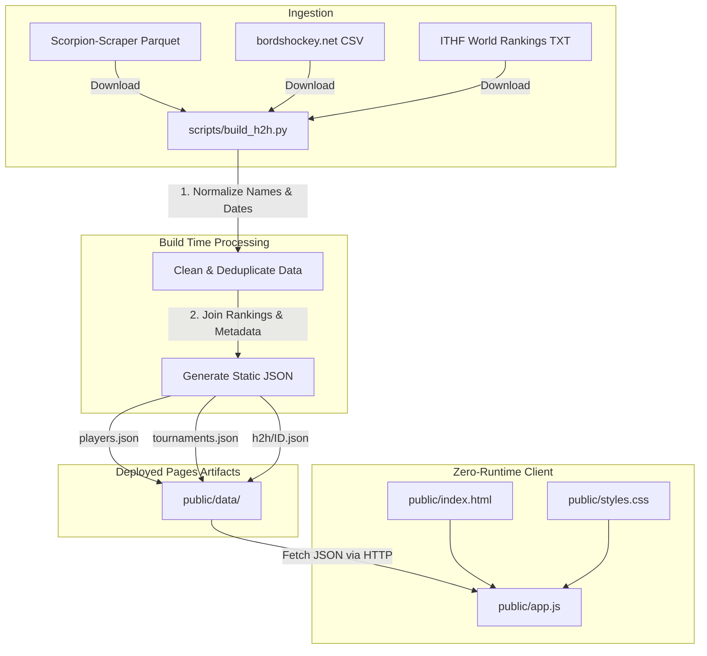

# Project Overview

Table Hockey H2H is a static, zero-runtime head-to-head statistics and matchup comparison dashboard
for competitive table hockey players and fans. The project adopts a build-time data-slicing
architecture, where raw Parquet and CSV tournament datasets are ingested, cleaned, and compiled
into highly optimized, static JSON files at CI/CD build time, which are then deployed to Cloudflare
Pages. This design enables a lightning-fast, serverless, and mobile-friendly frontend matchup
exploration interface with zero runtime database queries.

## Repository Structure

* `.github/` - Houses GitHub Action workflows for weekly automated and push-triggered builds.
* `.cache/` - Local cache directory used by build scripts to store downloaded source files.
* `design-system/` - Contains design resource directories and specifications.
* `public/` - The static web root containing the HTML, CSS, and vanilla JS frontend application.
* `scripts/` - Ingestion, caching, and processing Python scripts used to build the static dataset.
* `tests/` - Automated Python integration and validation tests verifying match counts and data sanity.

## Build & Development Commands

```bash
# Setup Virtual Environment
python3 -m venv .venv
source .venv/bin/activate

# Install Dependencies
pip install pandas pyarrow requests

# Build H2H Static Data (local run)
python3 scripts/build_h2h.py

# Customize Build Threshold
MIN_MATCHES=1000 python3 scripts/build_h2h.py

# Run Local Web Server
python -m http.server --directory public 8000

# Run Tests
python -m unittest -v
```

## Code Style & Conventions

* **Python**: Follows PEP 8 coding standards. Imports are sorted. Pandas data operations should
  favor vectorization over slow iterative row loops.
* **Frontend**: Vanilla ES6 JavaScript modules and vanilla CSS. Mobile-first design principles
  using HSL-tailored colors, Manrope typography for data and controls, and Fraunces for display
  headings as defined in `DESIGN.md`.
* **Formatting**: Line lengths should be wrapped to approximately 100 characters where possible.
* **Commit-message template**:
  > TODO: A standard commit-message template is not configured in this repository.

## Architecture Notes



The backend data-generation pipeline downloads raw tournament results, player profiles, and
rankings, normalizes names and date structures, and deduplicates matching results across overlapping
sources. It filters players with at least `MIN_MATCHES` (default 50) and groups all head-to-head
records into single player-centric files under `public/data/h2h/{playerId}.json`. The frontend is a
zero-runtime static application served by Cloudflare Pages that dynamically fetches these
pre-computed JSON files from `public/data/` using standard AJAX requests, preventing database
overhead and ensuring instant loading times on mobile and desktop.

## Testing Strategy

The testing suite consists of integration and verification tests under `tests/` using Python's
standard `unittest` framework.

* **Local Test Execution**:
  ```bash
  python -m unittest -v
  ```
* **CI Pipeline Execution**:
  The test suite runs automatically in the GitHub Actions `Validate H2H data` job during the `build`
  workflow. Tests run on every push to the `main` branch, on a weekly cron schedule, or via manual
  dispatch. Tests verify:
  1. Match counts match the raw source dataset.
  2. Ranking data and tournament levels match metadata.
  3. Nested H2H files exist for all eligible players.

## Security & Compliance

* **Secrets Handling**: `CLOUDFLARE_API_TOKEN`, `CLOUDFLARE_ACCOUNT_ID`, and
  `CLOUDFLARE_PROJECT_NAME` are stored as encrypted GitHub Repository Secrets and never checked
  into source control.
* **Dependency Scanning**:
  > TODO: Automated dependency vulnerability scanning (e.g. Dependabot) is not explicitly configured.
* **License Notes**:
  > TODO: A LICENSE file is not present in this repository.

## Agent Guardrails

* **Boundaries for Automated Agents**:
  * Agents should not modify raw source data cache files directly under `.cache/`.
  * Static JSON files under `public/data/` must never be edited manually; they are generated
    dynamically by `scripts/build_h2h.py`.
  * Large visual design system components or color variables must conform strictly to the tokens
    defined in `DESIGN.md`.
* **Token & Context Efficiency Rules**:
  * **DO NOT** perform directory listings, recursive searches, or wide greps over the
    `public/data/h2h/` directory, as it contains thousands of generated player files which will
    quickly exhaust the LLM's context window.
  * To understand the structure of the head-to-head datasets, inspect a single sample player file
    (e.g., `public/data/h2h/1000.json`) rather than reading multiple files.
  * Avoid reading raw `.cache/` data files directly. If you need to inspect or verify caching
    formats, load only a small preview (e.g., the first 5 rows of a Parquet or CSV file) using a
    custom script, rather than reading the entire file.
  * Always use the existing Python test suite (`python -m unittest -v`) to verify data builds and
    sanity instead of checking files manually.
* **Required Reviews**:
  > TODO: Pull Request review requirements are not explicitly configured.
* **Rate Limits**:
  > TODO: API rate limit policies for the backend or scraper download calls are not defined.

## Extensibility Hooks

* **Environment Variables**:
  * `MIN_MATCHES`: Sets the minimum matching games threshold for a player to be included in the
    build (default: 50).
  * `MATCHES_PARQUET_URL`: Overrides the source URL for scraped matches Parquet.
  * `PLAYERS_CSV_URL`: Overrides the source URL for player CSV.
  * `TOURNAMENTS_CSV_URL`: Overrides the source URL for tournament metadata.
  * `TOURNAMENT_METADATA_CSV_URL`: Overrides the source URL for tournament level classification.
  * `RANKING_TXT_URL`: Overrides the source URL for the ITHF world ranking text file.
* **Feature Flags**:
  * > TODO: Frontend feature flags are not defined in the application.

## Further Reading

* [DESIGN.md](DESIGN.md) - High-level layout rules, color definitions, and UI design principles.
* [PRODUCT.md](PRODUCT.md) - User persona descriptions, success criteria, and product requirements.
* [README.md](README.md) - Local setup, environment variable configs, and deployment guidance.
